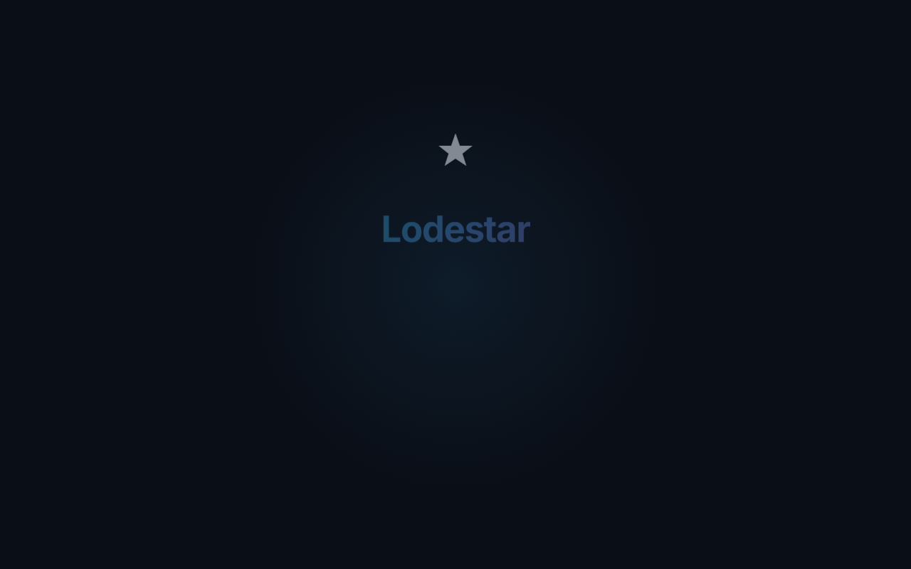
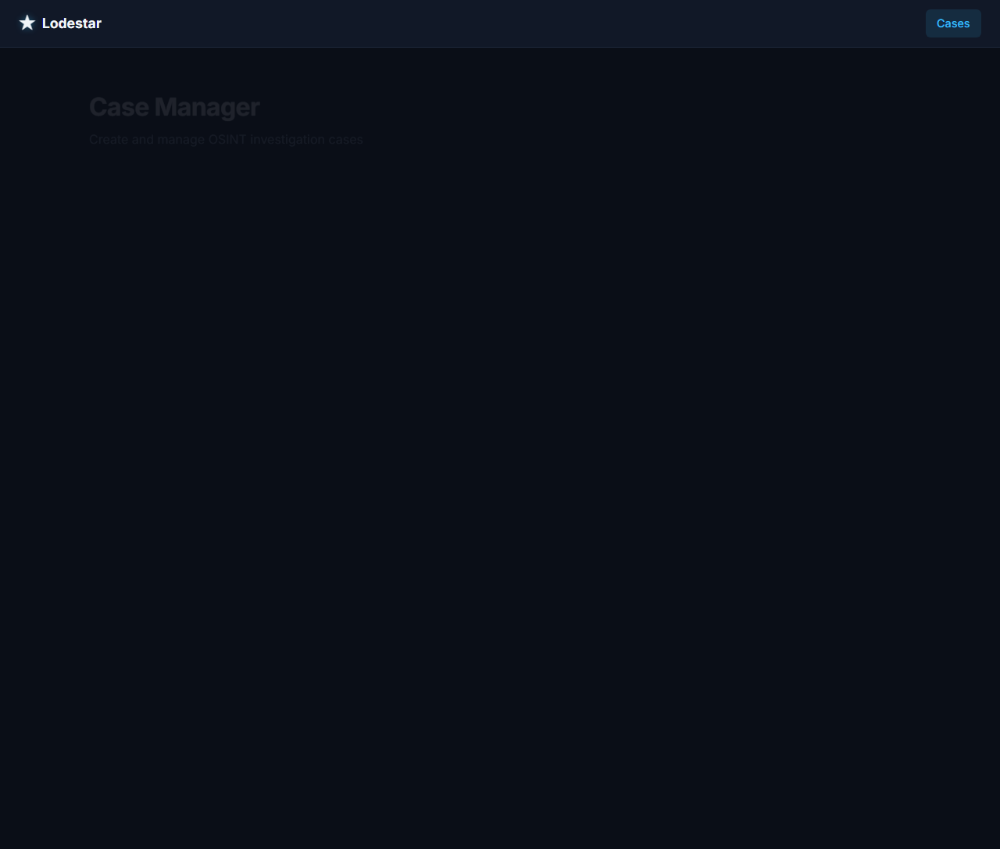

# Lodestar

**Passive-OSINT Case Assistant**

Lodestar is a Windows-local tool that helps one researcher run a disciplined, well-documented, **passive** open-source intelligence (OSINT) process for missing-persons CTF-style casework — Trace Labs' Search Party format, or a club-run equivalent modeled on it. It does not search, contact, or act on anyone's behalf. It helps you:

- log what you find, with a source URL and timestamp on every item — no exceptions
- correlate usernames/handles across platforms using existing, maintained open-source tools
- pull metadata out of images you've already legally viewed and saved
- track relationships (family, friends, associates) as they're *discovered from public posts*, never as targets to approach
- use a local LLM to summarize and triage a case that's grown too big to hold in your head
- export findings in the shape a CTF platform or investigator actually wants: one flag, one source link, one explanation

---

## Quickstart

### Prerequisites
- Windows 10/11
- Python 3.11+ (make sure it's in your PATH)
- (Optional) [Ollama](https://ollama.com/) for the LLM Triage Assistant. Pull a model via `ollama pull qwen2.5:7b` (or similar).

### Installation & Running

Lodestar comes with a zero-config Windows launcher that handles the virtual environment and dependencies for you.

1. Clone or download this repository.
2. Double-click `run_lodestar.bat`.
3. The launcher will automatically create a `.venv`, install the dependencies from `requirements.txt`, and open your default browser to `http://127.0.0.1:8420`.





---

## 1. Hard boundaries — read this section first, every time

These are load-bearing, not decorative. Trace Labs disqualifies contestants who cross them, and some cross into unauthorized-access law depending on jurisdiction. Lodestar is written to respect them by default, not as an afterthought.

**In scope:**
- reading pages a logged-out browser (or your own legitimate account) can already see
- storing what you manually find, with its source link
- checking public username-existence across sites (what Sherlock/Maigret already do — "does this handle exist here," never a login)
- pulling EXIF/metadata from images already on your disk
- summarizing and cross-referencing your own case notes with a local LLM
- pausing, stopping, or deleting a case or single finding at any time

**Out of scope, permanently, regardless of framing:**
- logging in as, impersonating, or contacting the subject, their family, or their friends
- bypassing authentication, CAPTCHAs, paywalls, or platform rate-limits
- automated scraping of platforms whose ToS prohibit it (Facebook, LinkedIn, Instagram) — these get a manual-import workflow instead of a scraper
- automating access to dark-web marketplaces or forums
- generating pretexts, fake profiles, or persuasive messages aimed at a real person

No organizational backing moves this list. A club or nonprofit can't authorize a member to bypass account security on its say-so — that exposure lands on the individual. If a volunteer group is ever telling members otherwise, that's worth raising with them directly, not designing around.

## 2. Why the constraint is the point, not a tax on it

A passive-only evidence trail is the only kind that's actually usable. Anything gathered by contacting people or bypassing access controls can tip off a suspect, retraumatize a family, taint an active investigation, or turn you from a volunteer into a subject of investigation yourself. Trace Labs built their entire ruleset around this because it's the only version of civilian missing-persons OSINT that doesn't make things worse. Lodestar encodes that ruleset as defaults so you don't have to remember it under pressure at 1am on a Sunday CTF.

## 3. Tech stack and why

| Layer | Choice | Why |
|---|---|---|
| Core logic | Python 3.11+ | Best OSINT library ecosystem; both Maigret and Sherlock are Python; trivial Ollama integration |
| Local web UI | FastAPI + plain HTML/JS, no build step | One command to run, nothing to package early, easy to debug in short daily sessions |
| Database | SQLite (file-based) | Zero-config, trivial to back up, trivial to encrypt |
| DB encryption | Fernet symmetric encryption | Leak-proofing: the case file is dead weight if copied off the machine |
| Local LLM | Ollama, model-agnostic (qwen2.5, llama3.1, whatever you swap in) | Case data never leaves your machine |
| Optional, later | Rust or Go for a bulk image-hashing module | Only after the Python MVP works end-to-end — speed isn't the early bottleneck |

Starting as a local web app instead of a packaged native app is deliberate. The double-click launcher (`run_lodestar.bat`) provides a native-like experience while remaining deeply hackable.

## 4. Architecture — data flow

```
You browse manually (a public LinkedIn page, a Reddit thread, a public FB post…)
        │
        ▼
You log a Finding in Lodestar
   {category, value, source_url, timestamp}
        │
        ▼
SQLite case database, encrypted at rest
        │
        ├─► Username Correlator (Maigret / Sherlock, clear-web mode only) — adds unverified candidate Findings
        ├─► Image module — EXIF/GPS/timestamp from imported photos, reverse-image-search links generated for YOU to run manually
        ├─► Relationship Notes — manual graph, every edge requires a source URL
        │
        ▼
Local Ollama call — summarizes the case, flags which Trace Labs categories
are thin, drafts (never sends) flag-submission text
        │
        ▼
Exporter — {category, value, source_url, explanation} per flag → CSV / text
for the CTF platform
```

## 5. Data model

- `cases(id, name, status[active|paused|stopped], created_at, notes)`
- `findings(id, case_id, category, value, source_url, added_at, verified bool)`
- `relationships(id, case_id, person_a, relation, person_b, source_url)`
- `images(id, case_id, path, source_url, exif_json, imported_at)`
- `script_runs(id, case_id, script_name, started_at, ended_at, approved bool, log_path)`

*(Note: Sensitive columns in the database are encrypted at rest using a symmetric key `lodestar.key` generated on first run.)*

## 6. Modules

1. **Case Manager** — create / pause / stop / delete; every other module checks status first, so pausing actually halts in-flight work, not just the UI.
2. **Finding Logger** — the core manual-entry workflow everything else feeds into.
3. **Username Correlator** — wraps `soxoj/maigret` (30k+ GitHub stars, 3000+ sites) and/or `sherlock-project/sherlock`. Run in default clear-web mode only.
4. **Image Importer** — drag-and-drop images you've already saved; extracts EXIF/GPS/timestamp; generates (doesn't auto-run) reverse-image-search links for Yandex/Google/TinEye.
5. **Relationship Mapper** — manual graph builder.
6. **LLM Triage Assistant** — local Ollama call over that case's findings only (not the whole DB — keeps it fast and keeps the prompt small); summarizes, flags gaps against the Trace Labs categories below, drafts submission text you review before it goes anywhere.
7. **Exporter** — formats a case into the flag-submission shape.
8. **Custom Script Runner** — your own read-only OSINT scripts, run only from a fixed `scripts/` folder, gated by an explicit confirm click per run, full stdout/stderr logging, case-status-aware (a paused case can't launch a script). 
9. **Encryption / Backup Layer** — at-rest DB encryption via Fernet, local-only binding (`127.0.0.1`, never `0.0.0.0`), encrypted export scripts, and `secure_delete` PRAGMA enabled.

## 7. Trace Labs flag categories (what the LLM triage prompt targets)

Friends · Family · Occupation · Basic Subject Info · Advanced Subject Info · Location. Some past events have also listed a Dark Web category — Lodestar surfaces that as a manual-research reminder only, never as an automated action, given the legal and personal-safety complexity of that terrain.

## 8. Backup & Restore

To take an encrypted backup of your case database, you can run:
```bat
.venv\Scripts\python.exe scripts\encrypted_backup.py
```
This produces `data/lodestar.db.enc`, which is useless without `lodestar.key`. 

To restore, use `scripts\decrypt_backup.py` and then replace `lodestar.db` with the decrypted file. 

## 9. A note on legality

This isn't legal advice — none of the above substitutes for actually reading whatever rules the specific CTF or org gives you, and laws on computer access and data scraping vary by jurisdiction. When in doubt, the passive/no-contact/no-bypass line above is the conservative default; stay on that side of it.
